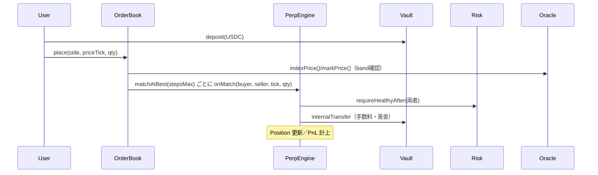
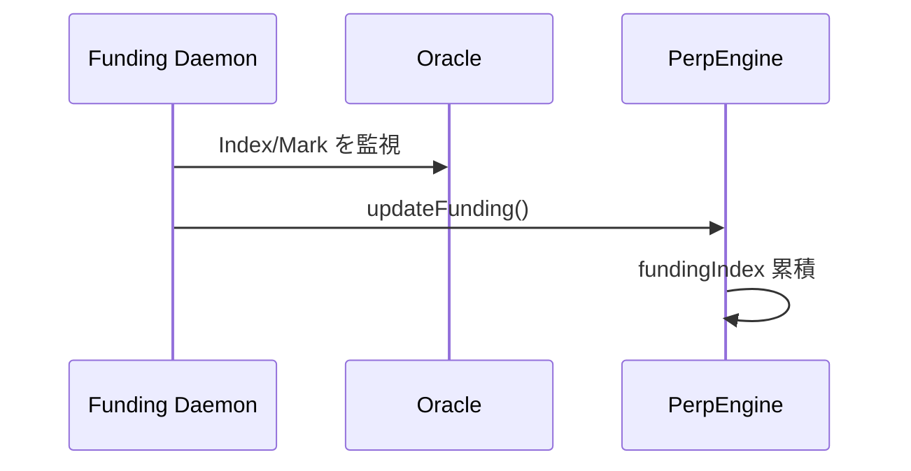
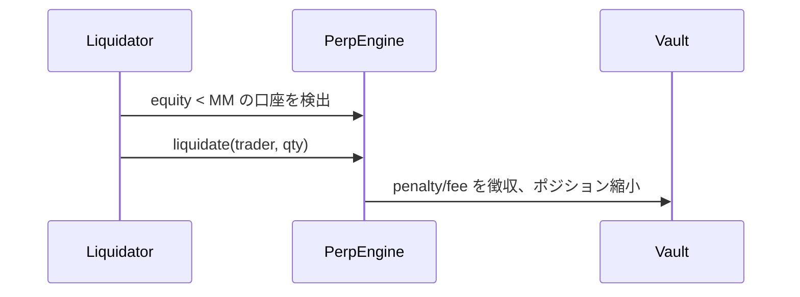

# オンチェーン板型 Perp DEX — やさしい解説（アーキテクチャ／フロー／用語集）

> **Purpose**: 先に作成した「最小仕様＋コントラクト雛形」を、非専門メンバーや関係者にも伝わるように噛み砕いて説明したガイド。技術的な厳密性は保ちつつ、言葉と図で直感的に理解できることを目指します。

---

## 0. まずは全体像（TL;DR）

* 本システムは **レバレッジ取引（Perp）** を **オンチェーンの注文板（CLOB）** で実現します。
* 取引の“板”と“約定”はチェーン上。価格の参照や清算トリガなど最低限だけオフチェーンに任せます。
* ユーザーは **USDC を入金** → **指値注文を板に置く** → **マッチングでポジションが更新** → 定期的な **Funding（資金調達料）** と **健全性チェック** → 必要なら **清算** という流れです。
* ガスやDoSを避けるため、約定は **ステップ上限（stepsMax）** を設け、1トランザクションで処理し過ぎないようにします。

---

## 1. アーキテクチャ（箱と矢印で理解）

```mermaid
flowchart LR
  subgraph ON[On-chain]
    V[Vault / Margin\n(入出金・内部振替)]
    OB[OrderBook\n(板: FIFO, bestBid/Ask)]
    PE[PerpEngine / Settlement\n(会計・PnL・Funding適用)]
    R[RiskEngine\n(IM/MM 健全性判定)]
    O[OracleAdapter\n(Index/Mark 参照)]
  end

  subgraph OFF[Off-chain]
    FD[Funding/Oracle デーモン]
    LQ[Liquidator ボット]
  end

  U[User] -->|deposit/withdraw| V
  U -->|place/cancel| OB
  OB -->|matchAtBest| PE
  PE -->|internalTransfer| V
  PE -->|equity/health check| R
  PE -->|read| O
  FD -->|updateFunding trigger| PE
  LQ -->|liquidate| PE
```

**要点**

* **OrderBook** は「どの価格で、誰が、いくつ買/売したいか」を並べるだけ。お金のやり取りや損益計算は **PerpEngine** が担当。
* **Vault** はユーザー資金の“金庫”。PerpEngine だけが内部振替できます。
* **RiskEngine** は「IM/MM を満たしているか」をチェックする係。
* **OracleAdapter** は「外の価格（Index）」と「内部の基準価格（Mark）」を教えてくれます。

---

## 2. 主要コンポーネント（やさしい説明）

### 2.1 Vault / MarginAccount（資金の金庫）

* 役割: ユーザーのUSDC入出金と、取引や清算で発生する差額の内部振替。
* ポイント: 出金は「安全（IMを満たす）」なときだけ。PerpEngine 以外は勝手に残高を動かせません。

### 2.2 OrderBook（板）

* 役割: 指値注文を **価格刻み（Tick）ごとのキュー** に積み、**最良気配（bestBid/Ask）** を管理。
* マッチング: `matchAtBest(stepsMax)` で最良買いと最良売りを何ステップかだけ突き合わせ。**上限あり**なのでDoSに強い。
* ガード: 最小数量や、**価格帯ガード（band）** で極端な値段の注文は拒否。

### 2.3 PerpEngine / Settlement（会計）

* 役割: 約定が来たらポジション更新、損益（PnL）計算、手数料やFundingの適用、Vaultへの内部振替、健全性チェック呼び出し。
* 大事な不変条件: **ゼロサム会計**（売買・手数料・保険基金まで総和が合う）。

### 2.4 RiskEngine（リスク判定）

* 役割: 初期証拠金（IM）・維持証拠金（MM）を基準に、発注や約定の前後でユーザー口座の健全性を判定。
* 例: 「今のポジション規模に対して担保が十分か？」を常に確認。

### 2.5 OracleAdapter（価格参照）

* 役割: **Index（外部価格）** と **Mark（内部基準価格）** を提供し、両者の乖離が大きすぎるときはサーキットブレーク。

### 2.6 Off-chain デーモン

* **Funding/Oracle デーモン**: 一定間隔で Funding を更新したり、オラクル障害を監視。
* **Liquidator ボット**: 基準を満たさない口座を見つけ次第、**部分/全清算** を実行。

---

## 3. 代表的なフロー

### 3.1 発注〜約定〜ポジション更新



### 3.2 Funding の更新



### 3.3 清算の流れ



---

## 4. 用語集（Glossary）

* **Tick / priceTick**: 価格を刻む最小単位。`price = tick * TICK_SIZE`。
* **bestBid / bestAsk**: 板の最良買い/最良売りの価格。
* **Level**: 同一価格の注文を並べたキュー（FIFO）。
* **stepsMax**: 1回の `matchAtBest` で処理する最大の突き合わせ回数。DoS回避の要。
* **band（価格帯ガード）**: 実行価格が Index からどれだけ離れてよいかの上限（例: ±2%）。
* **Vault / 内部振替**: チェーン上の金庫。PerpEngine だけがユーザー残高を増減できる内部関数を持つ。
* **Position（ポジション）**: `size`（ロング＋／ショート−）と平均建値（`entryNotional/size`）。
* **UPnL / Realized PnL**: 含み損益／確定損益。
* **IM / MM**: 新規/増し玉に必要な証拠金率（IM）、維持に必要な証拠金率（MM）。
* **Equity（エクイティ）**: 担保＋含み損益−未精算コストの合計。
* **Index / Mark**: Index＝外部価格（オラクル）、Mark＝内部の基準価格（Fundingや清算に利用）。
* **Funding Rate / Funding Index**: ロングとショートの間で支払われる調整料／その累積指標。
* **Insurance Fund**: 清算不足分を補填するための基金（MVPでは簡易）。

---

## 5. パラメータ早見表（MVPの例）

* `tickSize`: 価格刻み（例: \$0.01）。小さすぎるとガス増、大きすぎると価格精度が荒くなる。
* `minQty / minNotional`: スパム防止。板にゴミ注文が溜まるのを防ぐ。
* `stepsMax`: 約定処理の上限。大きいほど一度に進むが、ガスが増えDoSリスクも。
* `deviationLimit`: band。オラクルから乖離した実行を防止。
* `IMR / MMR`: 証拠金率。小さくするとレバレッジが上がるが清算リスクも上昇。
* `k / cap`: Funding の感度と上限。指数を荒らさずに偏りを均す調整弁。

---

## 6. よくある質問（FAQ）

**Q1. なぜ板もオンチェーン？** 透明性と真正性が最大の利点。誰でも板の状態と約定の正しさを検証可能。対価としてガスとスループットの制約があるため、L2前提。

**Q2. MEV 対策は？** 公開mempoolでは順序が歪む可能性。commit–reveal、private送信、あるいは FBA（バッチ処理）を将来導入する拡張余地あり。

**Q3. stepsMax の選び方は？** 目標TPSとガスのバランスで決める。最初は小さめ（例: 16）から始め、実測に応じて調整。

**Q4. オラクルが壊れたら？** `deviationLimit` と Pausable で緊急停止。出金専用モード（withdraw-only）を用意すると安全。

**Q5. マーケットを増やせますか？** 可能。ただしストレージとガス負荷が比例して増えるため、まずは1マーケットで実測→最適化→拡張が安全。

---

## 7. 次のステップ（実装ToDo）

* 手数料（Maker/Taker・清算手数料）と保険基金の会計を厳密化
* RiskEngine の `equity` 計算を Vault + UPNL 合算で厳格に
* ReentrancyGuard、アクセス制御（権限）、イベントの整備
* Funding の年率→秒換算、cap、TWAP などの安定化
* ガス最適化（価格レベル探索、ストレージ圧縮、バッチ設計）
* 将来の FBA モード／private 送信統合の検討

---

### 付録: 仕様書への対応マップ

* 本ガイドは「最小仕様＋コントラクト雛形」ドキュメントの **1〜10章** を平易化したものです。
* 詳細な関数仕様・イベント・不変条件・Solidity雛形は元ドキュメントを参照してください。
